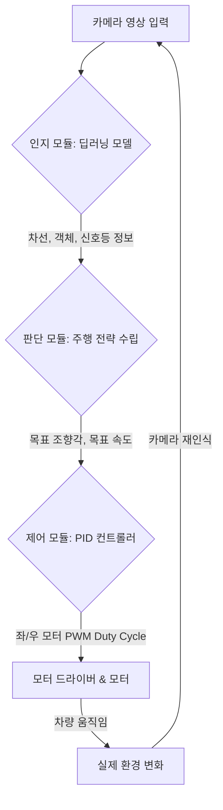

* toc
{:toc .large-only .toc-sticky:true}


<div class="insert-image" style="text-align: center;">
    
</div>


> - **영상 인식을 통한 자율주행 제어 구현** 
>   - 자율주행 프로젝트의 대미를 장식할 마지막 단계
>   - 지금까지 인지, 판단, 제어, 라즈베리파이 하드웨어 제어까지 각 부분을 개별적으로 학습했다면, 이제 이 모든 것을 하나로 엮어 실제로 작동하는 자율주행 미니카 시스템을 완성해 보는 단계
>   - 전체 시스템의 통합된 흐름을 이해하고, 이전 강의에서 배운 내용들을 어떻게 하나의 루프 안에서 유기적으로 연결하여 자율주행 미니카를 제어하는지 실습 코드를 통해 구현
{: .common-quote}


## **영상 인식을 통한 자율주행 제어 구현: 인지-판단-제어 시스템 통합**

> - **목표**
>   - 자율주행 인지-판단-제어 파이프라인의 통합적인 흐름과 각 모듈 간의 상호작용을 이해한다.
>   - 카메라 영상 입력부터 모터 제어 출력까지의 전 과정을 상세히 파악한다.
>   - 딥러닝 기반의 인지 모델 출력을 받아 판단 전략을 수립하고 PID 제어기로 차량을 구동하는 실시간 제어 시스템을 구축한다.
>   - TensorFlow 및 PyTorch 기반 딥러닝 모델을 라즈베리파이의 하드웨어 제어 루프에 통합하는 방법을 학습한다.
>   - 자율주행 시스템의 실제 구현 시 고려해야 할 중요 사항들(실시간성, 안정성, 안전성)을 이해한다.
{: .common-quote}


### **1. 전체 시스템 개요: 영상 인식을 통한 자율주행의 완전체**

#### 1.1. 자율주행 파이프라인 통합 (Recap)

- 지금까지 학습한 자율주행 시스템의 핵심 구성 요소

    1. **인지 (Perception)**
        - 차량 주변 환경(차선, 객체, 신호등)을 카메라 영상으로부터 딥러닝 모델을 통해 **'본다'**
            - 예: U-Net 차선 마스크, CNN 분류/탐지
    2. **판단 (Decision-making)**
        - 인지된 정보를 바탕으로 현재 상황을 **'이해하고 최적의 행동을 결정한다'**
            - 예: 차선 유지, 감속, 정지, 조향 각도 결정
    3. **제어 (Control)**
        - 판단된 행동을 수행하기 위해 차량의 물리적 구동 장치(모터, 브레이크, 조향)를 **'직접 조작한다'**
            - 예: PID 제어를 통한 모터 속도 및 방향 제어

- 핵심 구성 요소를 실시간으로 연결하여 하나의 완전한 자율주행 시스템 구축
    1. 카메라 영상이 입력되면
    2. 인지 모듈을 거쳐 판단 모듈에서 주행 전략을 수립하고
    3. 최종적으로 제어 모듈이 차량을 움직이는 연속적인 과정

#### 1.2. 전체 시스템 흐름도
아래 흐름도를 통해 각 모듈이 어떻게 연결되는지 한눈에 파악할 수 있습니다.



**단계별 상세 설명:**

1.  **카메라 영상 입력**: 라즈베리파이에 연결된 카메라(USB 또는 CSI)로부터 실시간 영상 스트림을 획득합니다.
2.  **인지 모듈 (Perception)**:
    *   획득된 영상을 딥러닝 모델(TensorFlow 또는 PyTorch)에 입력합니다.
    *   모델은 차선 마스크, 주변 객체(차량, 보행자 등)의 바운딩 박스/클래스, 신호등 상태, 도로 종류 등 다양한 인지 결과를 출력합니다.
3.  **판단 모듈 (Decision-making)**:
    *   인지 모듈의 출력을 바탕으로 현재 차량이 처한 상황(예: 차선 중앙으로부터 얼마나 벗어났는지, 앞차와의 거리, 신호등 색상 등)을 분석합니다.
    *   분석된 상황과 미리 정의된 주행 전략(예: 빨간불에 정지, 차선 중앙 유지)에 따라 `목표 조향 오차`와 `목표 속도`를 결정합니다.
4.  **제어 모듈 (Control)**:
    *   판단 모듈에서 결정된 `목표 조향 오차`와 `목표 속도`를 PID 컨트롤러의 `set_point` 또는 `error` 계산에 활용합니다.
    *   `목표 속도`와 차량의 `현재 속도`(가상 또는 센서 측정) 간의 오차를 바탕으로 종방향 PID 제어기가 `가속/감속 신호`를 출력합니다.
    *   `목표 조향 오차` (또는 차선 중앙으로부터의 `현재 편차`)를 바탕으로 횡방향 PID 제어기가 `조향 신호`를 출력합니다.
5.  **모터 드라이버 & 모터**:
    *   PID 제어기에서 출력된 `가속/감속 신호`와 `조향 신호`는 모터의 `PWM 듀티 사이클`과 `방향`을 결정하는 데 사용됩니다.
    *   `RPiMotorController` 클래스는 이 제어 신호를 받아 L298N 모터 드라이버를 통해 DC 모터의 속도와 방향을 조절합니다.
6.  **실제 환경 변화**: 모터가 회전하여 차량이 움직이면, 실제 환경이 변화하고 이는 다음 프레임에 다시 카메라 영상으로 입력되어 새로운 인지-판단-제어 루프가 시작됩니다.

#### 1.3. 통합 시스템의 중요성
*   **실시간 반응**: 카메라 영상이 입력되는 즉시 판단과 제어가 이루어져야 합니다. (보통 30FPS 이상 목표)
*   **복합적 상황 대응**: 단순히 차선만 보거나, 객체만 보는 것이 아니라 모든 인지 결과를 종합하여 복잡한 도로 상황에 대응할 수 있어야 합니다.
*   **시스템 안정성**: 각 모듈 간의 데이터 전달이 안정적이어야 하며, 한 모듈의 오류가 전체 시스템을 멈추게 하지 않도록 설계해야 합니다.

---

### **2. 통합 시스템 설계**

여기서는 이전 강의에서 학습한 PID 제어기(`PIDController`)와 라즈베리파이 모터 컨트롤러(`RPiMotorController`) 클래스를 재활용합니다. 핵심은 딥러닝 모델의 출력(인지 결과)을 어떻게 `판단`하고, 그 판단 결과를 PID 제어기에 연결하여 `모터를 제어`하는가입니다.

#### 2.1. 인지 모듈 (Perception) 출력 재정의
실제 복잡한 인지 모델을 학습시키는 것은 시간이 오래 걸리므로, 여기서는 다음과 같은 *가상의 인지 결과*를 딥러닝 모델이 출력한다고 가정합니다.

*   `lane_deviation_error` (float): 차량이 차선 중앙에서 얼마나 벗어났는지 (-1.0:최대 좌측, 0.0:중앙, 1.0:최대 우측)
*   `detected_objects` (list of dicts): 감지된 객체 목록 (예: `[{'class': 'car', 'distance': 10.5, 'x_center': 0.5}, ...]`)
*   `traffic_light_status` (str): 신호등 상태 (예: 'red', 'green', 'yellow', 'none')

#### 2.2. 판단 모듈 (Decision-making) 로직 설계
`_process_dl_output_for_decision` 함수에서 이 가상의 인지 결과를 받아, `목표 속도 (target_speed_mps)`와 `목표 조향 오차 (target_steering_error)`를 결정합니다.

*   **기본 전략**: 차선 중앙 유지 (`target_steering_error`를 `lane_deviation_error`에 기반하여 결정).
*   **속도 제어**: 기본 `target_speed`를 유지하되,
    *   빨간불이 감지되거나,
    *   앞차가 가까이 있으면 속도를 줄이거나 정지합니다.
*   **위험 회피**: 장애물이 감지되면 회피 또는 정지합니다.

#### 2.3. 제어 모듈 (Control) 통합
판단 모듈에서 결정된 `target_steering_error`와 `target_speed_mps`를 각각 횡방향(`steering_pid`)과 종방향(`speed_pid`) PID 제어기의 목표값으로 사용합니다.

*   **`steering_pid`**: `set_point = 0.0` (차선 중앙 목표), `current_value = lane_deviation_error`
*   **`speed_pid`**: `set_point = target_speed_mps`, `current_value = self.current_speed_mps` (차량의 가상 현재 속도)

---

### **3. 실습 코드: 영상 인식을 통한 자율주행 제어 구현**

#### A. 공통 모듈 (PID Controller, RPiMotorController)

이 클래스들은 이전 강의에서 정의된 내용을 그대로 사용합니다. 실제 라즈베리파이에서는 `RPi.GPIO`가 동작하고, PC에서는 `DummyGPIO`가 작동하여 코드를 테스트할 수 있게 합니다.

```python
# common_modules.py 파일로 저장한다고 가정합니다.

import RPi.GPIO as GPIO # 라즈베리파이가 아닐 경우 DummyGPIO로 대체됨
import time
import numpy as np

# --- PIDController 클래스 (이전 강의 내용 그대로 사용) ---
class PIDController:
    def __init__(self, Kp, Ki, Kd, set_point, output_limits=(-100.0, 100.0), integral_limits=None, dt=0.1):
        self.Kp = Kp
        self.Ki = Ki
        self.Kd = Kd
        self.set_point = set_point
        self.output_limits = output_limits
        self.integral_limits = integral_limits if integral_limits else (self.output_limits[0] * 10, self.output_limits[1] * 10)
        self.dt = dt

        self.integral = 0.0
        self.prev_error = 0.0

    def calculate_control_signal(self, current_value):
        error = self.set_point - current_value

        p_term = self.Kp * error

        self.integral += error * self.dt
        self.integral = np.clip(self.integral, self.integral_limits[0], self.integral_limits[1])
        i_term = self.Ki * self.integral

        derivative = (error - self.prev_error) / self.dt
        d_term = self.Kd * derivative

        control_signal = p_term + i_term + d_term
        control_signal = np.clip(control_signal, self.output_limits[0], self.output_limits[1])
        
        self.prev_error = error
        return control_signal
    
    def reset(self):
        self.integral = 0.0
        self.prev_error = 0.0

# --- RPiMotorController 클래스 (이전 강의 내용 그대로 사용) ---
# 라즈베리파이가 아닐 경우 DummyGPIO를 사용하기 위한 조건부 import
if not 'RPi.GPIO' in globals():
    print("WARNING: RPi.GPIO 라이브러리를 찾을 수 없습니다. Dummy GPIO 모드로 작동합니다.")
    class DummyGPIO:
        BCM = 0; OUT = 0; HIGH = 1; LOW = 0
        def setmode(self, mode): print(f"[DummyGPIO] setmode: {mode}")
        def setwarnings(self, flag): pass
        def setup(self, pin, mode): print(f"[DummyGPIO] setup pin {pin} as {mode}")
        def output(self, pin, value): print(f"[DummyGPIO] pin {pin} output: {value}")
        def cleanup(self): print("[DummyGPIO] cleanup")
        class PWM:
            def __init__(self, pin, frequency): self.pin = pin; print(f"[DummyPWM] PWM initialized on pin {pin} with {frequency}Hz")
            def start(self, duty_cycle): print(f"[DummyPWM] PWM {self.pin} started with {duty_cycle}%")
            def ChangeDutyCycle(self, duty_cycle): print(f"[DummyPWM] PWM {self.pin} changed duty cycle to {duty_cycle}%")
            def stop(self): print(f"[DummyPWM] PWM {self.pin} stopped")
    GPIO = DummyGPIO()

class RPiMotorController:
    def __init__(self, in1, in2, enA, in3, in4, enB):
        self.in1 = in1; self.in2 = in2; self.enA = enA
        self.in3 = in3; self.in4 = in4; self.enB = enB

        GPIO.setmode(GPIO.BCM)
        GPIO.setwarnings(False) 
        for pin in [self.in1, self.in2, self.enA, self.in3, self.in4, self.enB]:
            GPIO.setup(pin, GPIO.OUT)

        self.pwmA = GPIO.PWM(self.enA, 100)
        self.pwmB = GPIO.PWM(self.enB, 100)
        self.pwmA.start(0)
        self.pwmB.start(0)
        print("모터 컨트롤러 초기화 완료.")

    def set_motor_direction(self, motor_num, direction):
        if motor_num == 1:
            GPIO.output(self.in1, GPIO.HIGH if direction == 'forward' else GPIO.LOW)
            GPIO.output(self.in2, GPIO.HIGH if direction == 'backward' else GPIO.LOW)
        elif motor_num == 2:
            GPIO.output(self.in3, GPIO.HIGH if direction == 'forward' else GPIO.LOW)
            GPIO.output(self.in4, GPIO.HIGH if direction == 'backward' else GPIO.LOW)
    
    def set_motor_speed(self, motor_num, speed):
        speed = np.clip(speed, 0, 100)
        if motor_num == 1: self.pwmA.ChangeDutyCycle(speed)
        elif motor_num == 2: self.pwmB.ChangeDutyCycle(speed)

    def move_forward(self, speed):
        self.set_motor_direction(1, 'forward'); self.set_motor_direction(2, 'forward')
        self.set_motor_speed(1, speed); self.set_motor_speed(2, speed)

    def move_backward(self, speed):
        self.set_motor_direction(1, 'backward'); self.set_motor_direction(2, 'backward')
        self.set_motor_speed(1, speed); self.set_motor_speed(2, speed)

    def stop(self):
        self.set_motor_direction(1, 'stop'); self.set_motor_direction(2, 'stop')
        self.set_motor_speed(1, 0); self.set_motor_speed(2, 0)
        
    def turn(self, steering_input, base_speed):
        left_speed = base_speed
        right_speed = base_speed
        
        # 조향 입력에 따라 좌우 모터 속도 조절
        # steering_input이 양수이면 우회전 (오른쪽 바퀴 느리게), 음수이면 좌회전 (왼쪽 바퀴 느리게)
        if steering_input < 0: # 좌회전 (예: -1.0) -> left_speed 감소
            left_speed = max(0, base_speed * (1 + steering_input)) # 1 + (-1) = 0
            right_speed = base_speed
        elif steering_input > 0: # 우회전 (예: 1.0) -> right_speed 감소
            left_speed = base_speed
            right_speed = max(0, base_speed * (1 - steering_input)) # 1 - 1 = 0
        
        self.set_motor_direction(1, 'forward') # 항상 전진 방향으로 제어
        self.set_motor_direction(2, 'forward')
        self.set_motor_speed(1, left_speed)
        self.set_motor_speed(2, right_speed)

    def cleanup(self):
        self.stop()
        self.pwmA.stop()
        self.pwmB.stop()
        GPIO.cleanup()
        print("모터 컨트롤러 자원 해제 완료.")
```

#### B. 통합 제어 시스템 클래스 (`IntegratedAutonomousVehicle`)

이 클래스는 자율주행 시스템의 핵심 로직을 담당합니다.

```python
import cv2
import time
import numpy as np
import random # 더미 모델용

# common_modules.py에서 PIDController와 RPiMotorController를 임포트한다고 가정
# from common_modules import PIDController, RPiMotorController

# --- 시각화용 클래스 색상 (BDD100K 기준, 이전 강의에서 사용한 것과 동일) ---
# 세그멘테이션 클래스 이름과 색상을 매핑 (예시)
SEG_CLASS_COLORS = {
    0: (0, 0, 0),       # background (블랙)
    1: (128, 64, 128),  # road (자주)
    2: (244, 35, 232),  # sidewalk (핑크)
    3: (70, 70, 70),    # building (회색)
    7: (250, 170, 30),  # traffic light (주황)
    8: (220, 220, 0),   # traffic sign (노랑)
    12: (220, 20, 60),  # person (빨강)
    14: (0, 0, 142),    # car (진한 파랑)
    15: (0, 0, 70),     # truck (짙은 파랑)
    16: (0, 60, 100),   # bus (청색)
    18: (0, 0, 230)     # motorcycle (밝은 파랑)
    # ... 필요한 모든 클래스 정의
}
# 실제 모델의 출력에 따라 인덱스와 색상을 매핑해야 합니다.
# BDD100K semantic segmentation은 19개의 클래스를 가집니다.
SEG_CLASS_NAMES = {
    0: "background", 1: "road", 2: "sidewalk", 3: "building", 4: "wall",
    5: "fence", 6: "pole", 7: "traffic light", 8: "traffic sign", 9: "vegetation",
    10: "terrain", 11: "sky", 12: "person", 13: "rider", 14: "car",
    15: "truck", 16: "bus", 17: "train", 18: "motorcycle", 19: "bicycle" # 19개인데 인덱스는 0부터 18
}

class IntegratedAutonomousVehicle:
    def __init__(self, dl_model_path, motor_pin_config, image_size=(384, 640), dt=0.1, framework='tensorflow'):
        self.motor_controller = RPiMotorController(**motor_pin_config)
        
        # 횡방향 (조향) PID 제어기: 차선 중앙 유지
        self.steering_pid = PIDController(
            Kp=30.0, Ki=0.05, Kd=1.0, set_point=0.0, # 목표 조향 오차 0.0 (중앙)
            output_limits=(-1.0, 1.0), # -1.0 (최대 좌회전) ~ 1.0 (최대 우회전)
            dt=dt
        )
        
        # 종방향 (속도) PID 제어기
        self.speed_pid = PIDController(
            Kp=10.0, Ki=0.2, Kd=0.8, set_point=0.0, # 목표 속도 0.0 m/s
            output_limits=(-100.0, 100.0), # -100(최대 감속) ~ 100(최대 가속)
            dt=dt
        )
        
        self.dt = dt
        self.framework = framework
        self.image_size = image_size
        
        # 딥러닝 모델 로드 (프레임워크에 따라 다름)
        self.dl_model = self._load_dl_model_and_preprocessor(dl_model_path)
        
        # 차량의 현재 상태 (시뮬레이션용)
        self.current_speed_mps = 0.0 # m/s
        self.target_speed_mps = 0.0  # m/s (판단 모듈에서 결정)
        
        # 이전 프레임 시간 (FPS 계산용)
        self.prev_frame_time = time.time()
        self.fps = 0

    # --- DL 모델 로드 및 추론 (프레임워크별 구현) ---
    def _load_dl_model_and_preprocessor(self, model_path):
        """
        딥러닝 모델을 로드하고, 인퍼런스 함수를 반환합니다.
        (여기서는 실제 모델 대신 더미 인퍼런스 함수를 반환합니다.)
        """
        if self.framework == 'tensorflow':
            import tensorflow as tf
            # 실제 모델 로드 로직 (TFLite 최적화 모델 권장)
            # interpreter = tf.lite.Interpreter(model_path=model_path)
            # interpreter.allocate_tensors()
            # self.tf_input_details = interpreter.get_input_details()
            # self.tf_output_details = interpreter.get_output_details()
            # def tf_inference_fn(processed_img):
            #     interpreter.set_tensor(self.tf_input_details[0]['index'], processed_img)
            #     interpreter.invoke()
            #     lane_pred = interpreter.get_tensor(self.tf_output_details[0]['index'])
            #     seg_pred = interpreter.get_tensor(self.tf_output_details[1]['index'])
            #     obj_pred = interpreter.get_tensor(self.tf_output_details[2]['index'])
            #     return lane_pred, seg_pred, obj_pred
            # return tf_inference_fn
            
            # 더미 모델 인퍼런스 함수 반환
            print(f"[TensorFlow] Dummy DL Model Loaded: {model_path}")
            def dummy_tf_inference_fn(processed_img):
                # 인지 모델이 반환하는 가상의 출력들 (이전 강의에서 정의된 멀티태스크 출력)
                # lane_deviation_error, detected_objects, traffic_light_status, seg_mask
                
                # 가상의 차선 이탈 오차 (-0.4 ~ 0.4)
                lane_deviation_error = (random.random() - 0.5) * 0.8 
                
                # 가상의 객체 탐지 (앞차, 5~30m 거리)
                detected_objects = []
                if random.random() < 0.3: # 30% 확률로 앞차 감지
                    detected_objects.append({'class': 'car', 'distance': random.uniform(5, 30), 'x_center': 0.0})
                
                # 가상의 신호등 상태 (30% 확률로 빨간불)
                traffic_light_status = random.choice(['green', 'none'])
                if random.random() < 0.3:
                    traffic_light_status = 'red'
                
                # 가상의 세그멘테이션 마스크 (배경+도로)
                # seg_mask = np.random.randint(0, 19, (self.image_size[0], self.image_size[1]), dtype=np.uint8)
                seg_mask = np.zeros(self.image_size, dtype=np.uint8) # 일단 배경
                seg_mask[self.image_size[0]//2:, :] = 1 # 하단은 도로
                
                return lane_deviation_error, detected_objects, traffic_light_status, seg_mask
            return dummy_tf_inference_fn
            
        elif self.framework == 'pytorch':
            import torch
            # from your_pytorch_model_definition import MultiTaskPerceptionModel
            # model = MultiTaskPerceptionModel(...) # 모델 초기화
            # model.load_state_dict(torch.load(model_path, map_location='cpu')) # 라즈베리파이는 주로 CPU
            # model.eval()
            # self.pytorch_device = torch.device('cpu') # 라즈베리파이용
            # def pt_inference_fn(processed_img):
            #     img_tensor = torch.from_numpy(processed_img).permute(2,0,1).float().unsqueeze(0).to(self.pytorch_device)
            #     with torch.no_grad():
            #         lane_pred, seg_pred, obj_pred = model(img_tensor)
            #     # PyTorch 텐서 결과값을 numpy로 변환 및 필요한 형태로 후처리
            #     lane_mask = (lane_pred[0, 0].cpu().numpy() > 0.5)
            #     seg_mask = torch.argmax(seg_pred[0], dim=0).cpu().numpy()
            #     # ... 등등 복잡한 후처리
            #     return lane_deviation_error, detected_objects, traffic_light_status, seg_mask
            # return pt_inference_fn
            
            # 더미 모델 인퍼런스 함수 반환
            print(f"[PyTorch] Dummy DL Model Loaded: {model_path}")
            def dummy_pt_inference_fn(processed_img):
                # TensorFlow 더미와 동일한 가상 출력 생성
                lane_deviation_error = (random.random() - 0.5) * 0.8 
                detected_objects = []
                if random.random() < 0.3: detected_objects.append({'class': 'car', 'distance': random.uniform(5, 30), 'x_center': 0.0})
                traffic_light_status = random.choice(['green', 'none'])
                if random.random() < 0.3: traffic_light_status = 'red'
                
                seg_mask = np.zeros(self.image_size, dtype=np.uint8)
                seg_mask[self.image_size[0]//2:, :] = 1
                
                return lane_deviation_error, detected_objects, traffic_light_status, seg_mask
            return dummy_pt_inference_fn
        else:
            raise ValueError(f"Unsupported framework: {framework}. Use 'tensorflow' or 'pytorch'.")


    # --- 판단 모듈 (Decision-making) ---
    def _process_dl_output_for_decision(self, lane_deviation_error, detected_objects, traffic_light_status, seg_mask):
        """
        딥러닝 인지 결과를 바탕으로 차량의 목표 조향 및 속도를 결정합니다.
        (이전 강의의 '판단 모듈' 로직)
        """
        target_steering_error = lane_deviation_error # 차선 이탈 오차를 조향 PID의 목표 오차로 사용

        # 1. 기본 목표 속도 (m/s) 설정 (예: 5 m/s = 약 18 km/h)
        base_target_speed_mps = 5.0 
        final_target_speed_mps = base_target_speed_mps
        
        # 2. 신호등 상태에 따른 속도 조절
        if traffic_light_status == 'red':
            final_target_speed_mps = 0.0 # 정지
        elif traffic_light_status == 'yellow':
            final_target_speed_mps = min(final_target_speed_mps, 2.0) # 감속
            
        # 3. 앞차와의 거리에 따른 속도 조절
        for obj in detected_objects:
            if obj['class'] == 'car' and obj['distance'] < 10.0: # 10m 이내에 앞차 감지
                final_target_speed_mps = min(final_target_speed_mps, obj['distance'] / 2.0) # 거리에 비례하여 감속
                if obj['distance'] < 3.0: # 3m 이내면 거의 정지
                    final_target_speed_mps = 0.0
        
        # 최종 속도 목표는 음수가 될 수 없음
        final_target_speed_mps = max(0.0, final_target_speed_mps)
        
        return target_steering_error, final_target_speed_mps

    # --- 가상의 차량 속도 업데이트 (실제 차량에서는 센서로 측정) ---
    def _update_simulated_speed(self, speed_control_signal):
        """
        속도 PID 컨트롤러의 출력을 바탕으로 차량의 가상 속도를 업데이트합니다.
        실제 차량에서는 모터 인코더 등으로 속도를 측정합니다.
        """
        # 아주 간단한 차량 동역학 시뮬레이션
        # speed_control_signal은 -100 ~ 100 범위의 가속/감속 명령
        # 이를 가속도 (m/s^2)로 변환
        acceleration = speed_control_signal / 50.0 # 예시: 100% 가속 시 2 m/s^2 가속
        
        # 마찰/저항
        friction = self.current_speed_mps * 0.1 # 속도에 비례하는 마찰 (0.1은 계수)
        if acceleration > 0:
            net_acceleration = acceleration - friction
        else: # 감속 제어 신호가 들어오면, 마찰 + 감속
            net_acceleration = acceleration - friction
            
        self.current_speed_mps += net_acceleration * self.dt
        self.current_speed_mps = max(0.0, self.current_speed_mps) # 속도는 음수가 될 수 없음

    # --- 시각화 및 디버깅 정보 표시 ---
    def _visualize_control_info(self, frame, lane_deviation_error, detected_objects, traffic_light_status, final_target_speed_mps, steering_output_val, speed_output_duty):
        display_frame = frame.copy()
        
        # FPS 계산 및 표시
        current_time = time.time()
        self.fps = 1.0 / (current_time - self.prev_frame_time) if (current_time - self.prev_frame_time) > 0 else 0
        self.prev_frame_time = current_time

        # 시각화 텍스트
        cv2.putText(display_frame, f"FPS: {self.fps:.1f}", (10, 30), cv2.FONT_HERSHEY_SIMPLEX, 0.7, (255, 255, 255), 2)
        cv2.putText(display_frame, f"DL Lane Error: {lane_deviation_error:.3f}", (10, 60), cv2.FONT_HERSHEY_SIMPLEX, 0.7, (0, 255, 255), 2)
        cv2.putText(display_frame, f"Traffic Light: {traffic_light_status}", (10, 90), cv2.FONT_HERSHEY_SIMPLEX, 0.7, (0, 255, 0), 2)
        
        obj_text = ""
        for obj in detected_objects:
            obj_text += f"{obj['class']}:{obj['distance']:.1f}m "
        cv2.putText(display_frame, f"Objects: {obj_text}", (10, 120), cv2.FONT_HERSHEY_SIMPLEX, 0.7, (255, 0, 255), 2)

        cv2.putText(display_frame, f"Target Speed: {final_target_speed_mps:.2f} m/s ({final_target_speed_mps*3.6:.1f} km/h)", (10, 150), cv2.FONT_HERSHEY_SIMPLEX, 0.7, (255, 255, 0), 2)
        cv2.putText(display_frame, f"Current Speed (sim): {self.current_speed_mps:.2f} m/s", (10, 180), cv2.FONT_HERSHEY_SIMPLEX, 0.7, (255, 100, 0), 2)
        cv2.putText(display_frame, f"Steering Output: {steering_output_val:.3f}", (10, 210), cv2.FONT_HERSHEY_SIMPLEX, 0.7, (0, 150, 255), 2)
        cv2.putText(display_frame, f"Speed Output (PWM): {speed_output_duty:.1f}%", (10, 240), cv2.FONT_HERSHEY_SIMPLEX, 0.7, (0, 0, 255), 2)
        
        # 차선 중앙과 예측된 조향 오차 시각화
        img_center_x = display_frame.shape[1] // 2
        # 차량의 예측 위치 (오차에 비례하여 화면 내에서 이동)
        car_predicted_x = int(img_center_x + lane_deviation_error * img_center_x)
        
        cv2.line(display_frame, (img_center_x, display_frame.shape[0]-10), (img_center_x, display_frame.shape[0]-50), (255, 255, 255), 2) # 화면 중앙선
        cv2.circle(display_frame, (car_predicted_x, display_frame.shape[0]-30), 10, (0, 0, 255), -1) # 차량의 예상 위치
        
        return display_frame

    # --- 메인 자율주행 루프 ---
    def run_full_autonomous_loop(self, camera_index=0, initial_target_speed_kph=20):
        """카메라 영상을 통한 전체 자율주행 제어 루프 실행"""
        self.target_speed_mps = initial_target_speed_kph / 3.6 # 초기 목표 속도 설정 (m/s)

        cap = cv2.VideoCapture(camera_index)
        if not cap.isOpened():
            print("카메라를 열 수 없습니다. 카메라 인덱스를 확인하거나 USB 카메라를 연결하세요.")
            self.motor_controller.cleanup()
            return
            
        # 카메라 해상도 설정
        cap.set(cv2.CAP_PROP_FRAME_WIDTH, 640)
        cap.set(cv2.CAP_PROP_FRAME_HEIGHT, 480)

        print(f"\n--- 영상 인식 기반 자율주행 제어 루프 시작 (목표 속도: {initial_target_speed_kph:.1f} km/h) ---")
        print("종료하려면 'q' 키를 누르세요.")

        try:
            while True:
                ret, frame = cap.read()
                if not ret:
                    print("프레임을 받아오지 못했습니다.")
                    break
                
                # 1. 인지 (Perception): 딥러닝 모델 추론
                processed_img = cv2.resize(frame, (self.image_size[1], self.image_size[0])) / 255.0 # 모델 입력 크기
                lane_deviation_error, detected_objects, traffic_light_status, seg_mask_output = self.dl_model(processed_img)
                
                # 2. 판단 (Decision-making): 인지 결과를 바탕으로 목표 결정
                target_steering_error, final_target_speed_mps = self._process_dl_output_for_decision(
                    lane_deviation_error, detected_objects, traffic_light_status, seg_mask_output
                )
                
                # PID 컨트롤러의 목표값 업데이트
                self.steering_pid.set_point = target_steering_error
                self.speed_pid.set_point = final_target_speed_mps

                # 3. 제어 (Control): PID 제어기 구동
                # 횡방향 (조향) 제어
                steering_output_val = self.steering_pid.calculate_control_signal(lane_deviation_error)
                
                # 종방향 (속도) 제어
                speed_control_signal = self.speed_pid.calculate_control_signal(self.current_speed_mps)
                
                # 4. 모터 구동 명령으로 변환 및 하드웨어 제어
                # speed_control_signal (-100 ~ 100)을 듀티 사이클 (0 ~ 100)로 변환
                # 음수는 감속을, 양수는 가속을 의미하지만, base_speed는 항상 0 이상이어야 함.
                # 여기서는 speed_control_signal이 양수일 때만 속도를 내고, 음수이면 감속으로 간주
                
                base_speed_duty_cycle = 0.0
                if speed_control_signal > 0:
                    base_speed_duty_cycle = np.clip(speed_control_signal, 0, 100)
                else: # 감속 또는 정지 명령
                    base_speed_duty_cycle = 0 # 모터를 직접 역회전시키기 보다는 듀티 사이클을 낮춤
                
                self.motor_controller.turn(steering_output_val, base_speed_duty_cycle)
                
                # 5. 차량의 가상 속도 업데이트 (실제 차량에서는 센서로 측정)
                # 이 시뮬레이션에서는 PID 출력이 다음 current_speed_mps에 영향을 줌
                # 실제 차량에서는 제어 출력이 모터를 구동하고, 인코더 센서 등으로 실제 속도를 측정
                self._update_simulated_speed(speed_control_signal) # 현재 속도 시뮬레이션
                
                # 6. 시각화 및 디버깅
                display_frame = self._visualize_control_info(
                    frame, lane_deviation_error, detected_objects, traffic_light_status,
                    final_target_speed_mps, steering_output_val, base_speed_duty_cycle
                )
                cv2.imshow('Integrated Autonomous Driving System', display_frame)
                
                if cv2.waitKey(int(self.dt * 1000)) & 0xFF == ord('q'):
                    break

        except KeyboardInterrupt:
            print("사용자에 의해 자율주행이 중단되었습니다.")
        except Exception as e:
            print(f"자율주행 중 오류 발생: {e}")
        finally:
            cap.release()
            self.motor_controller.cleanup()
            print("\n--- 자율주행 제어 루프 종료 ---")

# --- 메인 실행 블록 ---
if __name__ == '__main__':
    # 라즈베리파이 GPIO 핀 번호 설정 (BCM 모드 기준)
    # 실제 연결에 따라 수정 필요!
    motor_pin_config = {
        'in1': 27, # Left Motor Direction Pin 1
        'in2': 22, # Left Motor Direction Pin 2
        'enA': 17, # Left Motor PWM Speed Pin
        'in3': 24, # Right Motor Direction Pin 1
        'in4': 23, # Right Motor Direction Pin 2
        'enB': 18, # Right Motor PWM Speed Pin
    }
    
    # --- 1. TensorFlow 기반 시스템 실행 ---
    print("\n[--- TensorFlow 기반 자율주행 시스템 시작 ---]")
    tf_dummy_model_path = "dummy_tf_model.h5" # 실제 모델 경로가 아니어도 더미 모델이 동작함
    tf_vehicle = IntegratedAutonomousVehicle(
        dl_model_path=tf_dummy_model_path,
        motor_pin_config=motor_pin_config,
        framework='tensorflow'
    )
    tf_vehicle.run_full_autonomous_loop(camera_index=0, initial_target_speed_kph=10) # 10 km/h로 시작
    
    # --- 2. PyTorch 기반 시스템 실행 ---
    # TensorFlow 테스트 후 실행하려면 다시 터미널을 열거나 주석 처리된 부분을 활성화하세요.
    # print("\n[--- PyTorch 기반 자율주행 시스템 시작 ---]")
    # pt_dummy_model_path = "dummy_pt_model.pth" # 실제 모델 경로가 아니어도 더미 모델이 동작함
    # pt_vehicle = IntegratedAutonomousVehicle(
    #     dl_model_path=pt_dummy_model_path,
    #     motor_pin_config=motor_pin_config,
    #     framework='pytorch'
    # )
    # pt_vehicle.run_full_autonomous_loop(camera_index=0, initial_target_speed_kph=10) # 10 km/h로 시작
```

---

### **4. 실습 과제 및 응용 아이디어**

1. **딥러닝 모델 통합**
    - 경량화된 차선 인식/객체 탐지/신호등 인식 모델(TFLite, ONNX 등)을 `_load_dl_model_and_preprocessor` 함수에 통합해 보기
    - 모델이 반환하는 실제 인지 결과(차선 폴리라인, 바운딩 박스 등)를 `_process_dl_output_for_decision` 함수에서 실제 조향 오차 및 객체 거리 등으로 변환하는 로직 구현해 보기
2. **판단 로직 정교화**
    - `_process_dl_output_for_decision` 함수 내의 판단 전략을 더욱 정교하게 만들어 보기
        - **우선순위 설정**
            - 차선 유지 vs. 객체 회피 vs. 신호등 정지 등 여러 상황이 동시에 발생할 경우의 우선순위 정의
        - **차선 변경**
            - 차선 변경이 필요한 상황(예: 전방 객체가 너무 느림) 판단, 안전하게 차선을 변경하는 로직 추가
        - **교차로 통과**
            - 교차로 진입 시 신호등뿐만 아니라 주변 차량과의 상호작용을 고려하는 로직 추가
3. **제어 파라미터 튜닝**
    - `PIDController`의 $K_p, K_i, K_d$ 값을 실제 미니카에 맞춰 최적화
    - 이 과정은 수많은 시행착오와 테스트를 필요로 함
4. **센서 퓨전 (가상)**
    - GPS, IMU, 초음파 센서 등 다른 센서에서 얻을 수 있는 *가상 정보*를 `_process_dl_output_for_decision`에 추가하여 판단 로직을 더욱 견고하게 만들어 보기
5. **시각화 강화**
    - `_visualize_control_info` 함수에 인지 모듈의 실제 출력 결과(예: 감지된 객체에 바운딩 박스 그리기, 세그멘테이션 마스크 오버레이)를 추가하여 디버깅 해 보고 시스템을 이해하기
6. **안전 기능 구현**
    - 비상 정지 버튼, 외부 간섭 감지 시 비상 정지 등 안전과 관련된 기능 추가

<br><br>

> - **결론 및 최종 학습 포인트**
>   - 영상 인식을 통한 자율주행 제어 구현 프로젝트는 자율주행의 전반적인 과정을 이론과 실습으로 모두 경험하는 기회를 제공합니다.
>       - **시스템 통합의 어려움과 중요성**
>           - 각 개별 모듈이 완벽하게 작동하더라도, 이들을 통합하고 연동하는 과정에서 발생하는 어려움(데이터 형식, 시간 동기화, 오류 전파 등)을 이해하고 해결하는 경험을 얻습니다.
>       - **실시간 처리의 도전**
>           - 제한된 하드웨어 자원(라즈베리파이)에서 딥러닝 추론, 판단, 제어를 모두 실시간으로 처리해야 하는 과제를 직접 겪어봅니다.
>           - 이는 성능 최적화(모델 경량화, 효율적인 코드 작성)의 중요성을 체감할 수 있습니다.
>       - **AI가 물리 세계에 미치는 영향**
>           - 딥러닝 모델의 숫자 하나, PID 게인 하나의 변화가 실제 차량의 움직임에 어떤 영향을 미치는지 눈으로 확인하며, 인공지능이 더 이상 추상적인 기술이 아님을 깨닫게 됩니다.
>       - **실패를 통한 학습**
>           - 처음부터 완벽한 자율주행 미니카는 없습니다.
>           - 수많은 오류, 예상치 못한 동작, 그리고 실패를 겪으며 디버깅하고 개선하는 과정 자체가 가장 큰 학습 경험이 될 것입니다.
{: .summary-quote}
